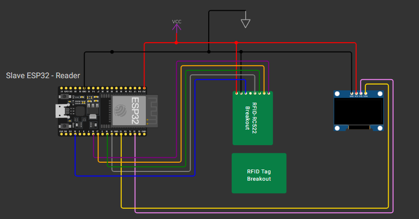

## Description
This is the repository that hosts the code for PBL IoT Project - Student Attendance Management System.

## Hardware
### Components
1. ESP32
2. RFID RC522 (Reader) + RFID Tag/Card
3. OLED Display 0.96″
4. Jumper Wires
5. Breadboard

### Circuit


## 🛠 Getting Started
### Prerequisites
0. Setup `PlatformIO` extension for VSCode [PlatformIO Extension Installation Tutorial](https://platformio.org/install/ide?install=vscode) or use official IDE - (PlatformIO Core and IDE Installation Tutorial)[https://platformio.org/install].

1. Create `config.h` file inside `include` folder, that will serve as a storage for sensitive variables. It should follow the structure:
```C
#ifndef ENV_H
#define ENV_H

#define WIFI_SSID "WIFI_SSID"
#define WIFI_PASSWORD "WIFI_PASSWORD"
#define SERVER_IP "SERVER_IP"
#define SERVER_PORT "SERVER_PORT"
#define SERVER_URL "http://" + String(SERVER_IP) + ":" + String(SERVER_PORT) + "/api/attendances/check"

#endif
```

### Code Building, Uploading and Monitoring
2. Go to `main.cpp` and use `Build` button or `Ctrl+Alt+B` shortcut in VSCode Extension or using CLI command:
```
pio run
```

3. Upload build code to the ESP32 using `Upload` button or `Ctrl+Alt+U` shortcut in VSCode Extension or using CLI command:
```
pio run --target upload
```

4. Open Serial Monitor using `Serial Monitor` button or `Ctrl+Alt+S` shortcut in VSCode Extension or using CLI command:
```
pio device monitor
```

### Usage
5. Approach RFID Tag or Reader to the RFID RC522 Module and check OLED Display for instructions.